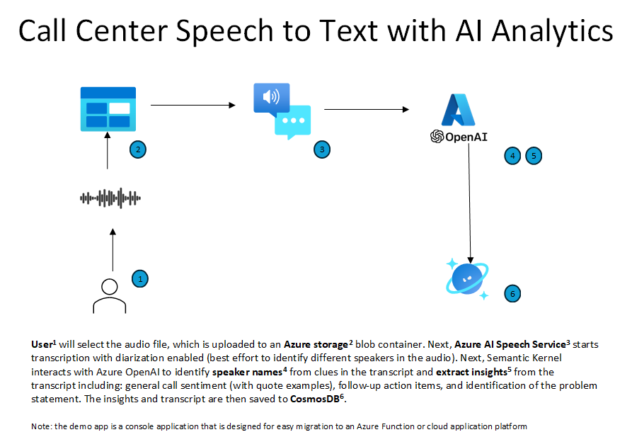
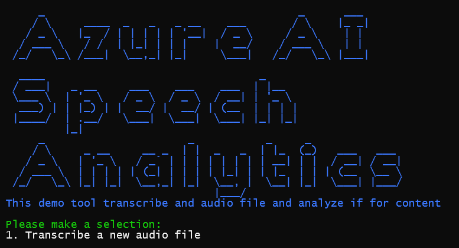
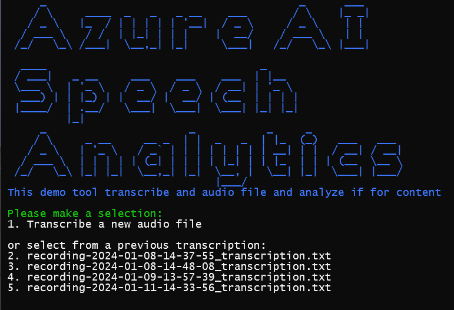

# Speech Analytics Demo
This demo highlights the power of combining Microsoft [Microsoft Foundry](https://learn.microsoft.com/en-us/azure/ai-foundry/what-is-foundry?view=foundry) with [Azure Speech to Text](https://learn.microsoft.com/en-us/azure/ai-services/speech-service/),  [Microsoft Foundry Agents](https://learn.microsoft.com/en-us/azure/ai-foundry/agents/overview?view=foundry) and the [Microsoft Agent Framework](https://learn.microsoft.com/en-us/agent-framework/overview/agent-framework-overview) to transcribe and analyze the content of a call center conversation.




### Deploying

Deployment is automated using PowerShell, the [Azure CLI](https://learn.microsoft.com/en-us/cli/azure/) and the [Azure Developer CLI](https://learn.microsoft.com/en-us/azure/developer/azure-developer-cli/). These can be easily installed on a Windows machine using `winget`:

``` bash
winget install --id "Microsoft.AzureCLI" --silent --accept-package-agreements --accept-source-agreements
winget install --id "Microsoft.Azd" --silent --accept-package-agreements --accept-source-agreements
```

**NOTE:** Since you will be deploying a new Microsoft Foundry instance instance, be aware there are location limitations base on Azure OpenAI model you may pick (see the [/infra/main.parameters.json's](/infra/main.parameters.json) `chatDeploymentName` value to change your target model). Please set your location value accordingly: 
[Region Availability](https://learn.microsoft.com/en-us/azure/ai-services/openai/concepts/models?tabs=global-standard%2Cstandard-chat-completions#model-summary-table-and-region-availability)

Also, depending on your available Azure OpenAI model quota, you may get a capacity related deployment error. If you do, you will need to modify the `capacity` value for the appropriate model found in the [`infra/aifoundryresource.bicep`](infra/aifoundryresource.bicep) file


``` powershell
# Login to the Azure Developer CLI
azd auth login  
#if you have access to multiple tenants, you may want to specify the tenant id
azd auth login --tenant-id "<tenant guid>"

# provision the resources
azd up

#follow the prompts for the parameter values...
```
If successful, this process will create:

- Storage account with two blob containers (`audio` for uploaded audio files and `transcription` for processed output)
- A Microsoft Foundry resource and project, with a `gpt-5-mini` and `text_embedding_3_large` deployments and a system assigned managed identiy
- Azure AI Search Service account
- Azure Cosmos DB account with container and database created
- Azure Application Insights resource automatically connected to the Microsoft Foundry project for telemetry and monitoring
- Azure Container Registry
- Azure Container App Environment with 2 container apps: `transcription` and `ask`
- User and system assigned managed identities with all appropriate RBAC assignments
- Log Analytics and App Insights
- Event Grid and subscription to the Upload event on the `audio` storage container


## Using the Container apps

To activate a transcription, simply upload an audio file to the `audio` blob container. The Event Grid subsciption will kick in and the `transcription` app will process the transcription.
To as questions about the transcription, you can make an HTTP get to the URL of the `ask` app using the `ask` route with a question query string `ask?question=ask your question here`. Be sure to mention the file name (in whole without the extension or in part) so that the Query Agent can retrieve the proper context

## Using demo console app
As part of the `azd up`, the local.settings.json file for the console app has been updated with all necessary configuraiton items and your identity has been given the needed RBAC roles


### First time run
When you run the app for the first time, select the `1` option to analyze a new call audio file.\
You will be prompted to enter the path to the audio file. The app will then upload the file to Blob storage and start the analysis process.

Alternatively, you can select the `2` option to transcribe and analyze all of the audio files in the Blob storage container.



The app will:
1. Upload the audio file to Blob storage (only for option 1)
2. Start the Speech to Text transcription batch process
3. Poll the transcription process until it is complete
4. Save the transcription results to Blob storage
5. Start the Azure Open AI analysis process which includes:
    - Sentiment analysis
    - Action item extraction
    - Problem statement and root cause determination
6. Save the analysis results to Cosmos DB using the transcription text file as a "CallId" key.

As each step is complete, the app will display the results in the console.

### Subsequent runs

Upon running again, the app will locate any prior transcription results and prompt you to use those or upload a new file. In addition, you can type in a question to ask regarding the transcription and insights of audio files that have already been analyzed.




